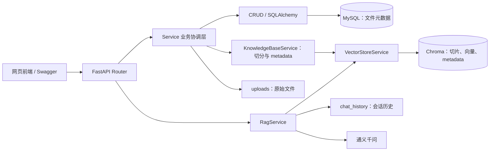

# RAG FastAPI

[](https://github.com/jiaxier0824/course-rag-fastapi/actions/workflows/test.yml)

一个面向课程资料的 RAG 知识库服务。支持上传 Markdown/TXT 文件、向量检索、带会话历史的问答，以及轻量网页界面。

它是独立服务；另一个 `RAG Agent FastAPI` 项目通过 HTTP 调用本服务，把知识库检索作为 Agent 工具。

## 核心能力

- 上传 UTF-8 编码的 `.txt` 和 `.md` 课程资料
- 文本切分后使用 `text-embedding-v4` 生成向量
- Chroma 持久化向量数据库，结合向量检索与 BM25 关键词检索
- RRF 融合两路召回，并使用 `qwen3-rerank` 二次精排候选切片
- MySQL 保存知识文件元数据
- 文件原文、MySQL 记录、Chroma 切片三处同步管理
- MD5 内容去重，避免重复上传相同资料
- 基于 `qwen-turbo` 的低延迟 RAG 问答
- 返回回答引用的来源文件名，便于用户追溯资料来源
- 请求级 `trace_id` 与 JSONL 调用链日志，记录检索、重排、生成耗时和来源
- 基于 `session_id` 的多轮对话历史
- FastAPI 接口文档与轻量网页问答界面

## 技术栈

Python、FastAPI、LangChain、通义千问、Chroma、MySQL、SQLAlchemy、Docker。

## 架构



上传链路：文件校验 → MD5 去重 → 原文件保存 → MySQL 建立文件记录 → 文本切分 → 向量写入 Chroma。

问答链路：用户问题 → 向量检索 + BM25 关键词检索 → RRF 融合 → `qwen3-rerank` 精排 → 组装提示词与会话历史 → 大语言模型生成回答与来源文件名。

## 本地配置

复制示例配置：

```bash
cp .env.example .env
```

然后在 `.env` 中填写归属当前业务空间的百炼密钥、重排配置和 MySQL 信息：

```env
DASHSCOPE_API_KEY=你的百炼API密钥
RERANK_ENABLED=true
RERANK_MODEL_NAME=qwen3-rerank
DASHSCOPE_WORKSPACE_ID=你的业务空间ID
CHAT_MODEL_NAME=qwen-turbo
DB_PASSWORD=你的MySQL密码
```

不要上传 `.env`。如果终端已有旧的 `DASHSCOPE_API_KEY` 环境变量，它会覆盖 `.env`；启动前执行 `unset DASHSCOPE_API_KEY`，让项目读取本地 `.env` 的新 Key。

## 持续集成

推送或创建 Pull Request 时，GitHub Actions 会在干净的 Python 3.12 环境中安装
`requirements.txt` 并运行 `pytest`。工作流只使用测试中的 Fake 依赖，不读取 `.env`，
不包含 API Key，也不会调用百炼模型。

## 检索评测

评测模块使用同一份标注题集比较两种检索排序：

- 基线：向量检索 + BM25 + RRF，直接取 Top 3；
- 优化：相同候选切片先召回 Top 6，再由 `qwen3-rerank` 重新排序并取 Top 3。

运行：

```bash
python -m evaluation.runner
```

它会读取 `evaluation/dataset.json`，并生成 `evaluation/report.json`。报告包含每题的
候选来源、基线与重排后的来源、Hit@3、MRR，以及向量检索、BM25、RRF、重排和总耗时。
若基线已将正确来源排在第 1 位，重排的价值主要表现为稳定性而非指标提升；应补充更具
混淆性的标注问题后，再客观比较质量变化。

## 调用链日志

每次 `POST /api/rag/chat` 都会生成 `trace_id` 并随响应返回；若上层 Agent 在请求头传入 `X-Trace-ID`，RAG 会沿用该 ID，使两项服务可以串成同一条调用链。后端同时向
`logs/rag_requests.jsonl` 追加一行 JSON：包含候选来源、最终来源、候选数、模型名、
向量检索/BM25/RRF/重排/生成各阶段耗时。日志不记录 API Key、用户问题正文或回答正文。
可用 `trace_id` 将接口响应和本地日志中的同一次请求对应起来。

## 启动

确保 MySQL 已启动后，在项目根目录运行：

```bash
python init_db.py
uvicorn api:app --reload --port 8000
```

打开：

- 网页界面：http://127.0.0.1:8000
- 接口文档：http://127.0.0.1:8000/docs
- 健康检查：http://127.0.0.1:8000/health

## 主要接口

- `POST /api/knowledge/upload`：上传 `.txt` 或 `.md` 资料
- `GET /api/knowledge/files`：分页查看资料
- `DELETE /api/knowledge/files/{file_id}`：删除资料及关联向量
- `POST /api/rag/chat`：基于知识库进行问答

问答请求示例：

```json
{
  "question": "INFS7410 的 Weekly quizzes 如何计分？",
  "session_id": "demo-session"
}
```

## Docker

项目提供 `Dockerfile` 与 `docker-compose.yml`，可一键启动 MySQL 与 RAG 服务：

```bash
docker compose up --build
```

Docker 环境会自动使用独立的 `rag_user` 账号；部署前请在 `.env` 中修改
`MYSQL_ROOT_PASSWORD` 和 `MYSQL_APP_PASSWORD`，不要保留示例密码。

本机若已有 MySQL 占用 `3306`，请将 `.env` 的 `MYSQL_PORT` 设为 `3307`；RAG API
仍然使用 `http://127.0.0.1:8000`，不会受影响。

首次启动会自动创建 MySQL 表。浏览器打开 `http://127.0.0.1:8000`。

停止服务但保留数据：

```bash
docker compose down
```

若要连同 Docker 中的 MySQL 数据一起删除，再执行：

```bash
docker compose down -v
```

注意：最后这条命令会删除数据库卷中的数据。

## 验收与测试

安装依赖后运行：

```bash
pytest -q
```

测试会用 Fake Service 替代 MySQL、Chroma 和大模型，验证健康检查、上传、分页列表、删除、问答接口的请求与响应契约。真实环境验收时，再使用网页或 `/docs` 完整执行一次“上传 → 提问 → 删除”的链路。

## 后续迭代

- 支持 PDF、Word 等更多文档格式
- 增加重排序与混合检索，提高召回准确率
- 加入 RAG 评测集与检索指标
- 作为独立 RAG 服务接入更多 Agent 工具
